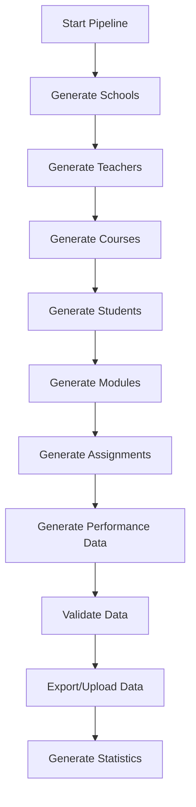

# Educational Data Generation Pipeline

## Overview

This project is a comprehensive educational data generation pipeline designed to simulate realistic student performance data for Israeli schools. The system generates synthetic data including schools, teachers, students, courses, modules, assignments, and performance metrics with sophisticated statistical distributions and realistic temporal patterns.

## Features

- **Multi-entity Data Generation**: Creates hierarchical educational data (Schools → Teachers → Courses → Modules → Assignments → Student Performance)
- **Realistic Statistical Distributions**: Uses skewed normal distributions and correlation patterns to simulate real-world performance
- **Mid-semester Analysis**: Supports both full-semester and mid-semester data generation for progress tracking
- **Hebrew Language Support**: All school names and subject areas are in Hebrew
- **Multiple Export Formats**: JSON, CSV, or both
- **Firebase Integration**: Optional cloud storage upload
- **Comprehensive Validation**: Built-in data consistency checks

## Project Structure

```
FinalProject/
├── src/
│   ├── main.py                     # Main pipeline orchestrator
│   ├── config/
│   │   ├── settings.py             # Configuration parameters
│   │   ├── school_data.py          # School-specific settings
│   │   └── admin-sdk.json          # Firebase credentials
│   ├── models/
│   │   ├── student.py              # Student data model
│   │   ├── teacher.py              # Teacher data model
│   │   ├── course.py               # Course data model
│   │   ├── module.py               # Module data model
│   │   ├── assignment.py           # Assignment data model
│   │   └── school.py               # School data model
│   ├── generators/
│   │   ├── school_generator.py     # School data generator
│   │   ├── user_generator.py       # Teacher/Student generators
│   │   ├── course_generator.py     # Course data generator
│   │   ├── module_generator.py     # Module data generator
│   │   ├── assignment_generator.py # Assignment generator
│   │   ├── performance_generator.py# Performance data generator
│   │   └── id_generator.py         # Unique ID management
│   ├── utils/
│   │   ├── date_utils.py           # Date manipulation utilities
│   │   ├── distribution_utils.py   # Statistical distribution functions
│   │   ├── export_utils.py         # Data export utilities
│   │   └── validation_utils.py     # Data validation functions
│   ├── firebase/
│   │   ├── firestore.py            # Firebase integration
│   │   └── firestore_admin.py      # Admin Firebase operations
│   └── output/                     # Generated data output directory
├── requirements.txt                # Python dependencies
└── README.md                       # This file
```

## Installation

### Prerequisites

- Python 3.8+
- pip package manager

### Setup

1. **Clone the repository:**
   ```bash
   git clone <repository-url>
   cd FinalProject
   ```

2. **Install dependencies:**
   ```bash
   pip install -r requirements.txt
   ```

3. **Configure Firebase (Optional):**
   - Place your Firebase admin SDK JSON file in `src/config/admin-sdk.json`
   - Update Firebase project settings in configuration files

## Usage

### Basic Usage

Generate data with default settings:

```bash
cd src
python main.py
```

### Command Line Options

```bash
python main.py [OPTIONS]
```

#### Available Options:

- `--upload`: Upload generated data to Firebase
- `--export {json,csv,both,none}`: Export format (default: none)
- `--output-dir PATH`: Output directory (default: ./src/output)
- `--mid-semester`: Generate mid-semester data instead of full-semester
- `--cutoff-date YYYY-MM-DD`: Custom mid-semester cutoff date
- `--variation-days N`: Variation window in days around cutoff date

### Usage Examples

1. **Generate and export to JSON:**
   ```bash
   python main.py --export json
   ```

2. **Generate mid-semester data:**
   ```bash
   python main.py --mid-semester --export both
   ```

3. **Custom mid-semester date:**
   ```bash
   python main.py --mid-semester --cutoff-date 2024-11-15 --variation-days 10 --export csv
   ```

4. **Upload to Firebase:**
   ```bash
   python main.py --upload --export json
   ```

## Data Generation Pipeline

### 1. Data Generation Flow



### 2. Entity Relationships

```
Schools (6 Israeli schools)
├── Teachers (5-20 per school)
│   └── Courses (1-5 per teacher)
│       ├── Students (12-30 per course)
│       ├── Modules (5-30 per course)
│       │   └── Assignments (1-2 per module)
│       │       └── Student Submissions
│       └── Performance Records
```

### 3. Statistical Distributions

#### Student Performance Profiles

The system generates four types of students with different performance characteristics:

| Profile | Base Score | Consistency | Proportion | Behavior |
|---------|------------|-------------|------------|----------|
| High Achiever | 90 | 85% | 15% | Consistently high scores, works ahead |
| Above Average | 80 | 75% | 35% | Good performance, occasional excellence |
| Average | 70 | 65% | 35% | Typical performance with variation |
| Struggling | 60 | 55% | 15% | Lower scores, more inconsistent |

#### Assignment Types and Distributions

Each assignment type has specific statistical characteristics:

| Type | Weight | Mean Score | Std Dev | Skewness | Description |
|------|--------|------------|---------|----------|-------------|
| Quiz | 15% | 75 | 12 | -0.5 | Short assessments |
| Exam | 30% | 70 | 15 | -0.7 | Major evaluations |
| Homework | 20% | 85 | 8 | -1.0 | Regular practice |
| Project | 25% | 82 | 10 | -0.8 | Extended assignments |

#### Subject Correlations

Students show correlated performance across related subjects:

- **STEM Correlation**: Mathematics ↔ Computer Science ↔ Sciences
- **Humanities Correlation**: Literature ↔ History ↔ Social Sciences
- **Language Correlation**: Literature ↔ Foreign Languages

### 4. Mid-Semester Analysis

When using `--mid-semester` flag, the system generates realistic mid-semester data:

#### Features:
- **Temporal Progression**: Assignments completed based on realistic timing
- **Student Profiles**: Different completion rates based on performance profiles
- **Subject Strength Impact**: Students perform better in their strong subjects
- **Future Assignment Handling**: Tracks assignments not yet available

#### Completion Probabilities:
- **High Achievers**: 70-95% completion, 20% work ahead
- **Above Average**: 60-90% completion, 10% work ahead  
- **Average Students**: 50-85% completion, 5% work ahead
- **Struggling Students**: 30-70% completion, 0% work ahead

## Configuration

### Main Settings (`config/settings.py`)

#### School Configuration
```python
SCHOOL_NAMES = [
    'אורט', 
    'אורט בהמה', 
    'בית ספר כציר - מסגב', 
    'מרכז חינוכי כרמל זבולון', 
    'בית ספר קציני חיל הים עכו', 
    'אירגון חקלאי פרדס חנה'
]
```

#### Subject Areas
```python
COURSE_SETTINGS = {
    "subject_areas": [
        "מתמטיקה",        # Mathematics
        "מדעים",          # Sciences  
        "היסטוריה",       # History
        "ספרות",          # Literature
        "מדעי המחשב",     # Computer Science
        "אמנות",          # Art
        "מוזיקה",         # Music
        "חינוך גופני",    # Physical Education
        "שפות זרות",      # Foreign Languages
        "מדעי החברה"      # Social Sciences
    ]
}
```

#### Mid-Semester Settings
```python
MID_SEMESTER_SETTINGS = {
    "target_date": datetime(2024, 11, 1),
    "variation_days": 14,
    "profile_progress_modifiers": {
        "High Achiever": 0.3,
        "Above Average": 0.15,
        "Average": 0,
        "Struggling": -0.2
    }
}
```

## Data Structure

### Core Entities

#### Students
```json
{
    "id": "STU_123456789",
    "name": "שם הסטודנט",
    "email": "student@school.edu",
    "schoolId": "SCH_123",
    "gradeLevel": 10,
    "basePerformance": 75.5,
    "subjectStrengths": {
        "מתמטיקה": 0.8,
        "מדעים": 0.6
    }
}
```

#### Courses
```json
{
    "id": "CRS_123456789",
    "name": "מתמטיקה מתקדמת",
    "subjectArea": "מתמטיקה",
    "schoolId": "SCH_123",
    "teacherId": "TCH_123456789",
    "startDate": "2024-09-01T00:00:00",
    "endDate": "2025-06-30T00:00:00"
}
```

#### Assignments
```json
{
    "id": "ASG_123456789",
    "title": "בחינה במתמטיקה",
    "type": "Exam",
    "courseId": "CRS_123456789",
    "moduleId": "MOD_123456789",
    "maxScore": 100,
    "weight": 0.3,
    "assignDate": "2024-10-01T00:00:00",
    "dueDate": "2024-10-15T00:00:00"
}
```

#### Student Performance
```json
{
    "id": "SA_123456789",
    "studentId": "STU_123456789",
    "assignmentId": "ASG_123456789",
    "courseId": "CRS_123456789",
    "score": 85,
    "timeSpent": 120,
    "submissionDate": "2024-10-14T14:30:00",
    "status": "completed"
}
```

### Mid-Semester Specific Data

#### Assignment Status Types
- **completed**: Assignment submitted and graded
- **pending**: Assignment available but not submitted
- **future**: Assignment not yet available to student

#### Progress Tracking
```json
{
    "studentId": "STU_123456789",
    "completionRate": 0.75,
    "averageScore": 82.5,
    "assignmentsCompleted": 15,
    "assignmentsPending": 3,
    "assignmentsFuture": 7
}
```

## Output Files

### File Structure

The system generates organized output directories:

```
output/
├── full_semester/               # Complete semester data
│   ├── csv/
│   │   ├── students.csv
│   │   ├── courses.csv
│   │   ├── assignments.csv
│   │   ├── studentAssignments.csv
│   │   └── ...
│   └── json/
│       ├── students.json
│       ├── courses.json
│       └── ...
├── mid_semester_20241101/       # Mid-semester data with date
│   ├── csv/
│   └── json/
└── mid_semester_analysis_20241101/  # Specialized analysis files
    ├── status/
    └── summary/
```

### CSV Format Examples

#### students.csv
```csv
id,name,email,schoolId,gradeLevel,basePerformance
STU_123456789,אריאל כהן,ariel@school.edu,SCH_123,10,75.5
```

#### studentAssignments.csv
```csv
id,studentId,assignmentId,courseId,score,timeSpent,submissionDate,status
SA_123,STU_123,ASG_456,CRS_789,85,120,2024-10-14T14:30:00,completed
```

## Statistical Analysis Features

### Performance Metrics

1. **Score Distributions**: Realistic bell curves with appropriate skewness
2. **Time Tracking**: Realistic time spent on different assignment types
3. **Correlation Analysis**: Subject-to-subject performance correlations
4. **Temporal Patterns**: Realistic submission timing and late submission rates

### Visualization Support

The generated data includes features for:
- Performance trend analysis
- Completion rate tracking
- Score distribution analysis
- Time management patterns
- Subject strength identification

## Firebase Integration

### Setup

1. Create a Firebase project
2. Generate admin SDK credentials
3. Place JSON file in `src/config/admin-sdk.json`

### Collections Structure

The system creates the following Firestore collections:
- `schools`
- `teachers`
- `students`
- `courses`
- `modules`
- `assignments`
- `studentAssignments`
- `studentCourses`

## Validation and Quality Assurance

### Data Validation

The system includes comprehensive validation:

1. **Referential Integrity**: All foreign keys are validated
2. **Date Consistency**: Logical date ordering
3. **Score Ranges**: Appropriate score distributions
4. **Enrollment Logic**: Realistic student-course relationships

### Logging

Comprehensive logging system tracks:
- Generation progress
- Validation results
- Export success/failure
- Statistical summaries

## Troubleshooting

### Common Issues

1. **Import Errors**: Ensure all dependencies are installed
   ```bash
   pip install -r requirements.txt
   ```

2. **Firebase Connection**: Check admin-sdk.json file placement and permissions

3. **Date Parsing**: Ensure date formats follow YYYY-MM-DD pattern

4. **Memory Issues**: For large datasets, consider generating smaller batches

### Debug Mode

Enable detailed logging by modifying the logging level in `main.py`:
```python
logging.basicConfig(level=logging.DEBUG)
```

## Contributing

### Development Setup

1. Fork the repository
2. Create a virtual environment
3. Install development dependencies
4. Run tests with `python test_future_assignments.py`

### Code Structure

- Follow existing naming conventions
- Add type hints to new functions
- Include comprehensive docstrings
- Update configuration files as needed

## License

This project is developed for educational purposes as part of a final project at an Israeli university.

## Acknowledgments

- Israeli school system for subject area definitions
- Firebase for cloud storage capabilities
- Scientific computing libraries for statistical distributions

---

For questions or support, please refer to the project documentation or contact the development team.