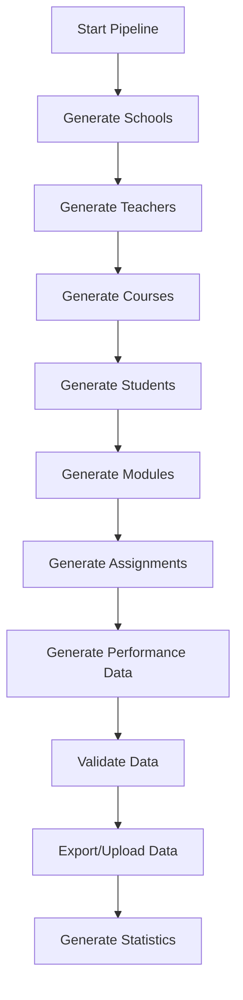

# Educational Data Generation Pipeline

## Overview

This project is a comprehensive educational data generation pipeline designed to simulate realistic student performance data for Israeli schools. The system generates synthetic data including schools, teachers, students, courses, modules, assignments, and performance metrics with sophisticated statistical distributions and realistic temporal patterns.

## Features

- **Multi-entity Data Generation**: Creates hierarchical educational data (Schools → Teachers → Courses → Modules → Assignments → Student Performance)
- **Realistic Statistical Distributions**: Uses skewed normal distributions and correlation patterns to simulate real-world performance
- **Mid-semester Analysis**: Supports both full-semester and mid-semester data generation for progress tracking
- **Hebrew Language Support**: All school names and subject areas are in Hebrew
- **Multiple Export Formats**: JSON, CSV, or both
- **Firebase Integration**: Optional cloud storage upload
- **Comprehensive Validation**: Built-in data consistency checks

## Project Structure

```
FinalProject/
├── src/
│   ├── main.py                     # Main pipeline orchestrator
│   ├── config/
│   │   ├── settings.py             # Configuration parameters
│   │   ├── school_data.py          # School-specific settings
│   │   └── admin-sdk.json          # Firebase credentials
│   ├── models/
│   │   ├── student.py              # Student data model
│   │   ├── teacher.py              # Teacher data model
│   │   ├── course.py               # Course data model
│   │   ├── module.py               # Module data model
│   │   ├── assignment.py           # Assignment data model
│   │   └── school.py               # School data model
│   ├── generators/
│   │   ├── school_generator.py     # School data generator
│   │   ├── user_generator.py       # Teacher/Student generators
│   │   ├── course_generator.py     # Course data generator
│   │   ├── module_generator.py     # Module data generator
│   │   ├── assignment_generator.py # Assignment generator
│   │   ├── performance_generator.py# Performance data generator
│   │   └── id_generator.py         # Unique ID management
│   ├── utils/
│   │   ├── date_utils.py           # Date manipulation utilities
│   │   ├── distribution_utils.py   # Statistical distribution functions
│   │   ├── export_utils.py         # Data export utilities
│   │   └── validation_utils.py     # Data validation functions
│   ├── firebase/
│   │   ├── firestore.py            # Firebase integration
│   │   └── firestore_admin.py      # Admin Firebase operations
│   └── output/                     # Generated data output directory
├── requirements.txt                # Python dependencies
└── README.md                       # This file
```

## Installation

### Prerequisites

- Python 3.8+
- pip package manager

### Setup

1. **Clone the repository:**
   ```bash
   git clone <repository-url>
   cd FinalProject
   ```

2. **Install dependencies:**
   ```bash
   pip install -r requirements.txt
   ```

3. **Configure Firebase (Optional):**
   - Place your Firebase admin SDK JSON file in `src/config/admin-sdk.json`
   - Update Firebase project settings in configuration files

## Usage

### Basic Usage

Generate data with default settings:

```bash
cd src
python main.py
```

### Command Line Options

```bash
python main.py [OPTIONS]
```

#### Available Options:

| Option | Type | Default | Description |
|--------|------|---------|-------------|
| `--upload` | flag | False | Upload generated data to Firebase |
| `--export` | choice | `none` | Export format: `json`, `csv`, `both`, or `none` |
| `--output-dir` | path | `./src/output` | Directory to save exported data |
| `--mid-semester` | flag | False | Generate mid-semester data instead of full-semester |
| `--cutoff-date` | date | `2024-11-01` | Custom mid-semester cutoff date (YYYY-MM-DD format) |
| `--variation-days` | integer | `14` | Variation window in days around cutoff date |

#### Detailed Option Descriptions:

**Export Options (`--export`)**:
- `none`: No files exported (data generation only)
- `json`: Export all collections as JSON files
- `csv`: Export all collections as CSV files  
- `both`: Export both JSON and CSV formats

**Output Directory (`--output-dir`)**:
- Specifies where generated files will be saved
- Creates subdirectories based on generation type:
  - `full_semester/` for complete semester data
  - `mid_semester_YYYYMMDD/` for mid-semester data with date
  - `mid_semester_analysis_YYYYMMDD/` for specialized analysis files

**Mid-Semester Options**:
- `--mid-semester`: Enables mid-semester mode with realistic completion rates
- `--cutoff-date`: Sets the reference date for determining completed vs pending assignments
- `--variation-days`: Creates natural variation in student progress (±N days from cutoff)

**Firebase Integration (`--upload`)**:
- Requires `src/config/admin-sdk.json` with Firebase credentials
- Uploads data to Firestore collections
- Can be combined with export options

### Usage Examples

1. **Basic generation with JSON export:**
   ```bash
   python main.py --export json
   ```

2. **Generate to custom directory:**
   ```bash
   python main.py --export csv --output-dir ./data/generated
   ```

3. **Mid-semester data with both formats:**
   ```bash
   python main.py --mid-semester --export both
   ```

4. **Custom mid-semester configuration:**
   ```bash
   python main.py --mid-semester --cutoff-date 2024-11-15 --variation-days 10 --export json
   ```

5. **Upload to Firebase without local files:**
   ```bash
   python main.py --upload
   ```

6. **Complete pipeline with all options:**
   ```bash
   python main.py --mid-semester --cutoff-date 2024-12-01 --variation-days 7 --export both --output-dir ./results --upload
   ```

7. **Full semester data with CSV export:**
   ```bash
   python main.py --export csv --output-dir ./semester_data
   ```

8. **Mid-semester analysis for specific date:**
   ```bash
   python main.py --mid-semester --cutoff-date 2024-10-15 --variation-days 5 --export both --output-dir ./mid_term_analysis
   ```

## Data Generation Pipeline

### 1. Data Generation Flow



### 2. Entity Relationships

```
Schools (6 Israeli schools)
├── Teachers (5-20 per school)
│   └── Courses (1-5 per teacher)
│       ├── Students (12-30 per course)
│       ├── Modules (5-30 per course)
│       │   └── Assignments (1-2 per module)
│       │       └── Student Submissions
│       └── Performance Records
```

### 3. Statistical Distributions

#### Student Performance Profiles

The system generates four types of students with different performance characteristics:

| Profile | Base Score | Consistency | Proportion | Behavior |
|---------|------------|-------------|------------|----------|
| High Achiever | 90 | 85% | 15% | Consistently high scores, works ahead |
| Above Average | 80 | 75% | 35% | Good performance, occasional excellence |
| Average | 70 | 65% | 35% | Typical performance with variation |
| Struggling | 60 | 55% | 15% | Lower scores, more inconsistent |

#### Assignment Types and Distributions

Each assignment type has specific statistical characteristics:

| Type | Weight | Mean Score | Std Dev | Skewness | Description |
|------|--------|------------|---------|----------|-------------|
| Quiz | 15% | 75 | 12 | -0.5 | Short assessments |
| Exam | 30% | 70 | 15 | -0.7 | Major evaluations |
| Homework | 20% | 85 | 8 | -1.0 | Regular practice |
| Project | 25% | 82 | 10 | -0.8 | Extended assignments |

#### Subject Correlations

Students show correlated performance across related subjects:

- **STEM Correlation**: Mathematics ↔ Computer Science ↔ Sciences
- **Humanities Correlation**: Literature ↔ History ↔ Social Sciences
- **Language Correlation**: Literature ↔ Foreign Languages

### 4. Mid-Semester Analysis

When using `--mid-semester` flag, the system generates realistic mid-semester data:

#### Features:
- **Temporal Progression**: Assignments completed based on realistic timing
- **Student Profiles**: Different completion rates based on performance profiles
- **Subject Strength Impact**: Students perform better in their strong subjects
- **Future Assignment Handling**: Tracks assignments not yet available

#### Completion Probabilities:
- **High Achievers**: 70-95% completion, 20% work ahead
- **Above Average**: 60-90% completion, 10% work ahead  
- **Average Students**: 50-85% completion, 5% work ahead
- **Struggling Students**: 30-70% completion, 0% work ahead

## Configuration

### Main Settings (`config/settings.py`)

#### School Configuration
```python
SCHOOL_NAMES = [
    'אורט', 
    'אורט בהמה', 
    'בית ספר כציר - מסגב', 
    'מרכז חינוכי כרמל זבולון', 
    'בית ספר קציני חיל הים עכו', 
    'אירגון חקלאי פרדס חנה'
]
```

#### Subject Areas
```python
COURSE_SETTINGS = {
    "subject_areas": [
        "מתמטיקה",        # Mathematics
        "מדעים",          # Sciences  
        "היסטוריה",       # History
        "ספרות",          # Literature
        "מדעי המחשב",     # Computer Science
        "אמנות",          # Art
        "מוזיקה",         # Music
        "חינוך גופני",    # Physical Education
        "שפות זרות",      # Foreign Languages
        "מדעי החברה"      # Social Sciences
    ]
}
```

#### Mid-Semester Settings
```python
MID_SEMESTER_SETTINGS = {
    "target_date": datetime(2024, 11, 1),
    "variation_days": 14,
    "profile_progress_modifiers": {
        "High Achiever": 0.3,
        "Above Average": 0.15,
        "Average": 0,
        "Struggling": -0.2
    }
}
```

## Data Structure

### Core Entities

#### Students
```json
{
    "id": "STU_123456789",
    "name": "שם הסטודנט",
    "email": "student@school.edu",
    "schoolId": "SCH_123",
    "gradeLevel": 10,
    "basePerformance": 75.5,
    "subjectStrengths": {
        "מתמטיקה": 0.8,
        "מדעים": 0.6
    }
}
```

#### Courses
```json
{
    "id": "CRS_123456789",
    "name": "מתמטיקה מתקדמת",
    "subjectArea": "מתמטיקה",
    "schoolId": "SCH_123",
    "teacherId": "TCH_123456789",
    "startDate": "2024-09-01T00:00:00",
    "endDate": "2025-06-30T00:00:00"
}
```

#### Assignments
```json
{
    "id": "ASG_123456789",
    "title": "בחינה במתמטיקה",
    "type": "Exam",
    "courseId": "CRS_123456789",
    "moduleId": "MOD_123456789",
    "maxScore": 100,
    "weight": 0.3,
    "assignDate": "2024-10-01T00:00:00",
    "dueDate": "2024-10-15T00:00:00"
}
```

#### Student Performance
```json
{
    "id": "SA_123456789",
    "studentId": "STU_123456789",
    "assignmentId": "ASG_123456789",
    "courseId": "CRS_123456789",
    "score": 85,
    "timeSpent": 120,
    "submissionDate": "2024-10-14T14:30:00",
    "status": "completed"
}
```

### Mid-Semester Specific Data

#### Assignment Status Types
- **completed**: Assignment submitted and graded
- **pending**: Assignment available but not submitted
- **future**: Assignment not yet available to student

#### Progress Tracking
```json
{
    "studentId": "STU_123456789",
    "completionRate": 0.75,
    "averageScore": 82.5,
    "assignmentsCompleted": 15,
    "assignmentsPending": 3,
    "assignmentsFuture": 7
}
```

## Output Files

### File Structure

The system generates organized output directories based on your command-line options:

#### Default Output Structure (`--output-dir ./src/output`):

```
output/
├── full_semester/               # When running without --mid-semester
│   ├── csv/                     # When using --export csv or --export both
│   │   ├── schools.csv          # School information
│   │   ├── teachers.csv         # Teacher profiles
│   │   ├── students.csv         # Student information
│   │   ├── courses.csv          # Course details
│   │   ├── modules.csv          # Module information
│   │   ├── assignments.csv      # Assignment specifications
│   │   ├── studentAssignments.csv # All student submissions
│   │   ├── studentCourses.csv   # Course enrollment and grades
│   │   └── metadata.csv         # Generation metadata
│   └── json/                    # When using --export json or --export both
│       ├── schools.json         # Same data in JSON format
│       ├── teachers.json
│       ├── students.json
│       ├── courses.json
│       ├── modules.json
│       ├── assignments.json
│       ├── studentAssignments.json
│       ├── studentCourses.json
│       └── metadata.json
├── mid_semester_20241101/       # When using --mid-semester (date from --cutoff-date)
│   ├── csv/                     # Same structure as full_semester
│   │   ├── schools.csv
│   │   ├── teachers.csv
│   │   ├── students.csv
│   │   ├── courses.csv
│   │   ├── modules.csv
│   │   ├── assignments.csv
│   │   ├── studentAssignments.csv # Includes completed, pending, and future assignments
│   │   ├── studentCourses.csv
│   │   ├── pendingAssignments.csv # Mid-semester specific: available but not submitted
│   │   ├── futureAssignments.csv  # Mid-semester specific: not yet available
│   │   ├── midSemesterReport.csv  # Progress summary
│   │   └── metadata.csv
│   └── json/                    # Same collections in JSON format
│       └── ...
└── mid_semester_analysis_20241101/ # Specialized analysis files (mid-semester only)
    ├── status/                  # Assignment status breakdown
    │   ├── completion_by_student.csv
    │   ├── completion_by_course.csv
    │   └── status_summary.json
    └── summary/                 # Progress summaries
        ├── student_progress.csv
        ├── course_progress.csv
        └── overall_statistics.json
```

#### Custom Output Structure (`--output-dir ./custom/path`):

When you specify a custom output directory, the same structure is created at your specified location:

```bash
# Example with custom directory
python main.py --export both --output-dir ./data/experiment1
```

Creates:
```
data/
└── experiment1/
    └── full_semester/
        ├── csv/
        └── json/
```

### File Contents Overview

#### Core Data Files (Generated with all options):

| File | Description | Key Fields |
|------|-------------|------------|
| `schools.csv/json` | Israeli school information | id, name, address, phone |
| `teachers.csv/json` | Teacher profiles | id, name, email, schoolId, subjects |
| `students.csv/json` | Student information | id, name, email, schoolId, gradeLevel, basePerformance |
| `courses.csv/json` | Course definitions | id, name, subjectArea, teacherId, schoolId, startDate, endDate |
| `modules.csv/json` | Course modules | id, name, courseId, isRequired, startDate, endDate |
| `assignments.csv/json` | Assignment specifications | id, title, type, moduleId, courseId, maxScore, weight, dueDate |
| `studentAssignments.csv/json` | Student submissions | id, studentId, assignmentId, score, timeSpent, submissionDate, status |
| `studentCourses.csv/json` | Course enrollments | id, studentId, courseId, finalGrade, completionRate |
| `metadata.csv/json` | Generation info | generatedAt, isMidSemester, cutoffDate, variationDays |

#### Mid-Semester Specific Files (Only with `--mid-semester`):

| File | Description | Key Fields |
|------|-------------|------------|
| `pendingAssignments.csv/json` | Available but unsubmitted assignments | studentId, assignmentId, isAvailable, status |
| `futureAssignments.csv/json` | Not yet available assignments | studentId, assignmentId, isAvailable, status |
| `midSemesterReport.csv/json` | Progress summary | totalStudents, avgCompletionRate, assignmentStats |

#### Analysis Files (Mid-semester with specialized export):

| File | Description | Contents |
|------|-------------|----------|
| `completion_by_student.csv` | Per-student completion rates | studentId, completed, pending, future, completionRate |
| `completion_by_course.csv` | Per-course completion statistics | courseId, avgCompletion, studentCount, assignmentCount |
| `student_progress.csv` | Detailed student progress | studentId, courseId, moduleProgress, assignmentProgress |
| `overall_statistics.json` | Summary statistics | totalAssignments, completionRates, performanceStats |

### Export Format Details

#### CSV Format:
- Headers included in first row
- UTF-8 encoding for Hebrew text
- Date fields in ISO format (YYYY-MM-DDTHH:MM:SS)
- Nested objects flattened with dot notation

#### JSON Format:
- Pretty-printed with 2-space indentation
- UTF-8 encoding
- Date fields as ISO strings
- Nested objects preserved as JSON objects
- Arrays for collections

### Firebase Collections (When using `--upload`):

If you use the `--upload` flag, the following Firestore collections are created:
- `schools` - School documents
- `teachers` - Teacher documents  
- `students` - Student documents
- `courses` - Course documents
- `modules` - Module documents
- `assignments` - Assignment documents
- `studentAssignments` - Student submission documents
- `studentCourses` - Course enrollment documents

### Common Usage Scenarios

#### Scenario 1: Full Academic Year Analysis
```bash
python main.py --export both --output-dir ./full_year_data
```
**Generates**: Complete semester data with all assignments completed, ideal for end-of-year analysis.

#### Scenario 2: Mid-Semester Progress Tracking
```bash
python main.py --mid-semester --export csv --output-dir ./progress_check
```
**Generates**: Realistic mid-semester data showing student progress, pending assignments, and future work.

#### Scenario 3: Custom Mid-Semester Date Analysis
```bash
python main.py --mid-semester --cutoff-date 2024-12-15 --variation-days 5 --export both
```
**Generates**: Mid-semester data as if checking progress on December 15th, with 5-day variation window.

#### Scenario 4: Research Data Collection
```bash
python main.py --export json --output-dir ./research_data --upload
```
**Generates**: JSON files for analysis and uploads to Firebase for cloud access.

#### Scenario 5: Multiple Time Points
```bash
# Early semester
python main.py --mid-semester --cutoff-date 2024-10-01 --export csv --output-dir ./early_semester

# Mid semester  
python main.py --mid-semester --cutoff-date 2024-11-15 --export csv --output-dir ./mid_semester

# Late semester
python main.py --mid-semester --cutoff-date 2024-12-30 --export csv --output-dir ./late_semester
```
**Generates**: Multiple snapshots showing progression throughout the semester.

### CSV Format Examples

#### students.csv
```csv
id,name,email,phone,schoolId,gradeLevel,entryYear,basePerformance,profileType,createdAt,updatedAt
STU_123456789,אריאל כהן,ariel.cohen@school.edu,050-1234567,SCH_123,10,2023,75.5,Above Average,2024-09-24T10:00:00,2024-09-24T10:00:00
STU_987654321,שרה לוי,sarah.levi@school.edu,052-9876543,SCH_123,10,2023,90.2,High Achiever,2024-09-24T10:00:00,2024-09-24T10:00:00
```

#### studentAssignments.csv (Full Semester)
```csv
id,studentId,assignmentId,courseId,moduleId,score,maxScore,timeSpent,submissionDate,isLate,status,createdAt,updatedAt
SA_123,STU_123456789,ASG_456,CRS_789,MOD_101,85,100,120,2024-10-14T14:30:00,false,completed,2024-10-14T14:30:00,2024-10-14T14:30:00
SA_124,STU_123456789,ASG_457,CRS_789,MOD_101,92,100,95,2024-10-20T16:45:00,false,completed,2024-10-20T16:45:00,2024-10-20T16:45:00
```

#### studentAssignments.csv (Mid-Semester)
```csv
id,studentId,assignmentId,courseId,moduleId,score,maxScore,timeSpent,submissionDate,isLate,status,isAvailable,createdAt,updatedAt
SA_123,STU_123456789,ASG_456,CRS_789,MOD_101,85,100,120,2024-10-14T14:30:00,false,completed,true,2024-10-14T14:30:00,2024-10-14T14:30:00
PA_124,STU_123456789,ASG_457,CRS_789,MOD_101,,,,,false,pending,true,2024-09-24T10:00:00,2024-09-24T10:00:00
FA_125,STU_123456789,ASG_458,CRS_789,MOD_102,,,,,false,future,false,2024-09-24T10:00:00,2024-09-24T10:00:00
```

#### courses.csv
```csv
id,name,description,subjectArea,schoolId,teacherId,startDate,endDate,accessCode,published,createdAt,updatedAt
CRS_789,מתמטיקה מתקדמת,קורס מתמטיקה לכיתה י,מתמטיקה,SCH_123,TCH_456,2024-09-01T08:00:00,2025-06-30T16:00:00,MATH2024,true,2024-09-01T08:00:00,2024-09-01T08:00:00
```

#### assignments.csv
```csv
id,title,description,type,courseId,moduleId,maxScore,weight,assignDate,dueDate,isActive,createdAt,updatedAt
ASG_456,בחינה במתמטיקה - פרק 1,בחינה הראשונה בקורס,Exam,CRS_789,MOD_101,100,0.30,2024-10-01T08:00:00,2024-10-15T23:59:00,true,2024-10-01T08:00:00,2024-10-01T08:00:00
ASG_457,תרגיל בית - משוואות,תרגיל בית על פתרון משוואות,Homework,CRS_789,MOD_101,50,0.20,2024-10-10T08:00:00,2024-10-25T23:59:00,true,2024-10-10T08:00:00,2024-10-10T08:00:00
```

## Statistical Analysis Features

### Performance Metrics

1. **Score Distributions**: Realistic bell curves with appropriate skewness
2. **Time Tracking**: Realistic time spent on different assignment types
3. **Correlation Analysis**: Subject-to-subject performance correlations
4. **Temporal Patterns**: Realistic submission timing and late submission rates

### Visualization Support

The generated data includes features for:
- Performance trend analysis
- Completion rate tracking
- Score distribution analysis
- Time management patterns
- Subject strength identification

## Firebase Integration

### Setup

1. Create a Firebase project
2. Generate admin SDK credentials
3. Place JSON file in `src/config/admin-sdk.json`

### Collections Structure

The system creates the following Firestore collections:
- `schools`
- `teachers`
- `students`
- `courses`
- `modules`
- `assignments`
- `studentAssignments`
- `studentCourses`

## Validation and Quality Assurance

### Data Validation

The system includes comprehensive validation:

1. **Referential Integrity**: All foreign keys are validated
2. **Date Consistency**: Logical date ordering
3. **Score Ranges**: Appropriate score distributions
4. **Enrollment Logic**: Realistic student-course relationships

### Logging

Comprehensive logging system tracks:
- Generation progress
- Validation results
- Export success/failure
- Statistical summaries

## Troubleshooting

### Common Issues

1. **Import Errors**: Ensure all dependencies are installed
   ```bash
   pip install -r requirements.txt
   ```

2. **Firebase Connection**: Check admin-sdk.json file placement and permissions

3. **Date Parsing**: Ensure date formats follow YYYY-MM-DD pattern

4. **Memory Issues**: For large datasets, consider generating smaller batches

### Debug Mode

Enable detailed logging by modifying the logging level in `main.py`:
```python
logging.basicConfig(level=logging.DEBUG)
```

## Contributing

### Development Setup

1. Fork the repository
2. Create a virtual environment
3. Install development dependencies
4. Run tests with `python test_future_assignments.py`

### Code Structure

- Follow existing naming conventions
- Add type hints to new functions
- Include comprehensive docstrings
- Update configuration files as needed

## License

This project is developed for educational purposes as part of a final project at an Israeli university.

## Acknowledgments

- Israeli school system for subject area definitions
- Firebase for cloud storage capabilities
- Scientific computing libraries for statistical distributions

---

For questions or support, please refer to the project documentation or contact the development team.